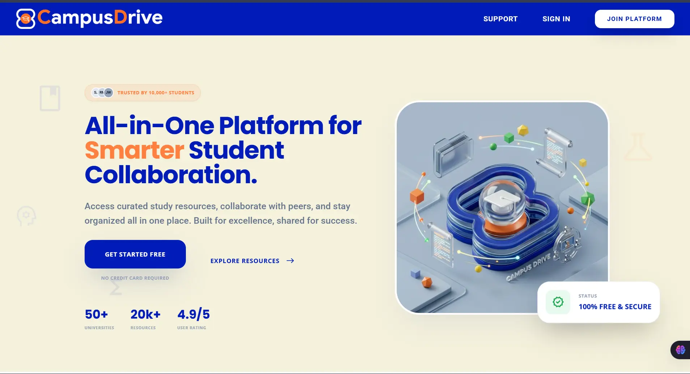

<p align="center">
  
</p>

<h1 align="center">CampusDrive</h1>
<p align="center">
  <em>AI-Powered Academic Collaboration Platform  -  Bridge the gap between curriculum and collective intelligence.</em>
</p>

<p align="center">
  
  
  
  
  
  
  
  
</p>

<p align="center">
  
</p>

---

## Product Strategy

### Problem

University students face a fragmented academic ecosystem  -  notes scattered across WhatsApp groups, Google Drives, and email threads with no unified discovery, no quality validation, and no AI-assisted learning. Teachers lack tooling to distribute materials to multiple cohorts efficiently. Existing platforms are either too generic (Google Classroom) or too narrow (WhatsApp groups) to serve as a true academic hub.

### Solution

CampusDrive provides a single, secure, AI-augmented platform where students discover peer-reviewed resources and teachers broadcast curricula to study circles  -  all backed by a Gemini-powered academic assistant, **Aradhaya**. Every feature is designed around three pillars: **discovery**, **verification**, and **collaboration**.

### Design Philosophy  -  Glassmorphism Academic

A Google Classroom-inspired glassmorphism aesthetic with a custom brand palette (`#001BB7` primary blue, `#FF8040` accent orange, `#F5F1DC` beige background). Fluid `clamp()`-based typography via Poppins, Roboto, and Open Sans. Zero external animation libraries  -  all micro-interactions use native CSS transitions. Every viewport is accounted for, scaling perfectly down to 320px without horizontal overflow.

### GEO-First Architecture

Every section heading is followed by a concise, descriptive subtitle  -  optimized for both human readers and AI crawlers. A dedicated `ai.txt` contextual crawl guidance file, AI-friendly `robots.txt` (allowing GPTBot, ChatGPT-User, Google-Extended, PerplexityBot, Claude-Web, CCBot, OAI-SearchBot, Applebot-Extended), per-page canonical URLs, auto-generated `sitemap.xml`, and JSON-LD `WebSite` schema complete the Generative Engine Optimization layer.

---

## Key Features

### 👨‍🎓 Student Experience

| Capability | Details |
|---|---|
| **Knowledge Vault** | Searchable public repository with smart filters (subject, semester, type, branch, sort) |
| **Favorites & Reviews** | Build a personal library; rate resources with 1-5 star reviews and recalculated averages |
| **Study Circles** | Join private groups via invite codes (`AAAA-0000`); access exclusive materials, announcements, and chat |
| **Aradhaya.ai** | Context-aware AI assistant answering conceptual queries with structured markdown responses |

### 👨‍🏫 Teacher & Admin Tools

| Capability | Details |
|---|---|
| **Circles++ Broadcast** | Simultaneously push announcements and resources to multiple study circles |
| **Circle Management** | Create groups with unique codes, post announcements, chat, share/upload resources directly |
| **Admin Dashboard** | Full system overview  -  users by role, teacher stats (uploads, groups), global resource/groups counts |
| **Approvals Queue** | Approve or reject pending student/teacher registrations with one click |
| **Content Moderation** | Delete any user, resource, or announcement across the platform |

### 🛡️ Security & Infrastructure

| Capability | Details |
|---|---|
| **Role-Based Access Control** | Three-tier RBAC (Student, Teacher, Admin) with `@admin_required` route guards |
| **CSRF Protection** | Flask-WTF CSRF on every form and POST endpoint with `csrf_token()` in templates |
| **Bcrypt Hashing** | PBKDF2 password hashing with per-user salts via `flask-bcrypt` |
| **Secure Sessions** | `HTTPOnly`, `Secure`, `SameSite=Lax` cookies |
| **MongoDB Optimization** | Connection pooling (50 max, 2500ms timeout), prebuilt indexes on `download_count`, `avg_rating`, `created_at` |

### 🤖 AI & Discoverability

| Capability | Details |
|---|---|
| **Aradhaya AI** | Google Gemini 2.5 Flash with role-aware system prompts; enforces structured markdown (meaning, key points, workflow, pros/cons, examples) |
| **LLM-Ready Metadata** | `ai.txt` contextual crawl guidance, `robots.txt` (allows major AI crawlers), auto-generated `sitemap.xml`, `humans.txt` |
| **Structured Data** | JSON-LD Schema.org `WebSite` graph injected into every page via `base.html` |
| **Open Graph / Twitter Cards** | Rich link previews with `og:image`, `twitter:card`, custom titles and descriptions |

### 🎨 Frontend Design

| Capability | Details |
|---|---|
| **Glassmorphism Theme** | Custom brand palette (`#001BB7`, `#FF8040`, `#F5F1DC`), backdrop blur panels, premium SVG arch footer |
| **100% Responsive** | Fluid down to 320px viewports with mobile hamburger menu, custom breakpoint logic |
| **Typography** | Google Fonts (Poppins headings, Roboto body, Open Sans UI) with `clamp()` fluid scaling |
| **Icons** | Material Symbols Rounded  -  consistent, weight-variable icon system |
| **Micro-interactions** | Hover-lift cards, underline-anchored nav links, animated stat counters, pulse status indicators |

---

## Architecture Overview

```
                         ┌─────────────────────┐
                         │    Tailwind CSS      │
                         │  Jinja2 Templates    │
                         └────────┬────────────┘
                                  │
┌──────────┐    ┌─────────────────▼──────────────────┐    ┌───────────┐
│ Browser  │────▶   Flask (Waitress WSGI)             │────▶ MongoDB   │
│ (Mobile/ │    │   Blueprints: auth, main, resources │    │ Atlas     │
│ Desktop) │    │   groups, admin, aradhaya, errors   │    └───────────┘
└──────────┘    └─────────────────┬──────────────────┘
                                  │
                         ┌────────▼────────┐
                         │  Google Gemini  │
                         │  2.5 Flash API  │
                         └─────────────────┘
```

### User Flow Map

| Action | Student | Teacher | Admin |
|---|---|---|---|
| Register as pending user | ✅ | ✅ |  -  |
| Approve/reject users | ❌ | ❌ | ✅ |
| Browse public resources | ✅ | ✅ | ✅ |
| Upload resources | ✅ | ✅ | ✅ |
| Create study circles | ❌ | ✅ | ✅ |
| Join circles | ✅ | ✅ | ✅ |
| Post announcements | ❌ | ✅ | ✅ |
| Broadcast (Circles++) | ❌ | ✅ | ❌ |
| Delete any resource | ❌ | ❌ | ✅ |
| Chat in circles | ✅ | ✅ | ✅ |
| Aradhaya AI assistant | ✅ | ✅ | ✅ |

---

## Tech Stack

| Layer | Technology |
|---|---|
| **Backend** | Python 3.10+, Flask 3.0, Waitress WSGI |
| **Database** | MongoDB Atlas (PyMongo with connection pooling) |
| **Auth & Security** | Flask-Login, Flask-Bcrypt, Flask-WTF (CSRF) |
| **AI / ML** | Google Generative AI (Gemini 2.5 Flash) |
| **Frontend** | Tailwind CSS (CDN), Custom CSS with glassmorphism, Google Fonts (Poppins/Roboto/Open Sans), Material Symbols |
| **Templating** | Jinja2 with block inheritance, JSON-LD structured data |
| **File Handling** | Werkzeug secure filenames, UUID-based renaming, extension whitelist (`pdf`, `docx`, `pptx`, `xlsx`, `png`, `jpg`, `jpeg`) |
| **Testing** | Python backend logic tests, role-specific test runners (Student, Teacher, Admin) |
| **Deployment** | Gunicorn/Waitress, Procfile, rotating file logging |
| **SEO / AI** | `robots.txt`, `sitemap.xml`, `ai.txt`, `llms.txt`, `humans.txt`, Open Graph, Twitter Cards, JSON-LD `@graph` |

### Performance

| Metric | Approach |
|---|---|
| **Image Optimization** | Compressed `.png` and `.webp` assets, `favicon.ico` for legacy browsers |
| **Font Loading** | Google Fonts via `<link>` preconnect with `display=swap` (no FOUT) |
| **Database** | MongoDB connection pooling (50 max, 2500ms timeout), prebuilt ranking indexes |
| **Logging** | Rotating file handler (10 KB × 10 backups), production info-level logging |
| **Bundle** | Zero runtime animation libraries  -  all effects are CSS-native transition and keyframe |

---

## Project Structure

```
CampusDrive/
├── app.py                      # App factory  -  MongoDB init, extensions, Blueprint registration
├── wsgi.py                     # Waitress production entry point
├── config.py                   # Environment-based configuration (MONGO_URI, SECRET_KEY, GEMINI_API_KEY)
├── Procfile                    # Heroku/render deployment definition
├── project_run.bat             # One-click Windows launcher
├── requirements.txt            # Python dependencies (13 packages)
├── .env.example                # Environment variable template
│
├── routes/                     # Flask Blueprints
│   ├── auth.py                 # Register, login, logout (Student & Teacher flows)
│   ├── main.py                 # Home, dashboard, profile, contact, static SEO files
│   ├── resources.py            # Upload, social feed, subjects/vault, detail, download, favorites, reviews
│   ├── groups.py               # Circles CRUD, join, chat, announcements, Circles++ broadcast
│   ├── admin.py                # Admin database, approvals, delete users/resources
│   ├── aradhaya.py             # Gemini-powered AI chat interface
│   └── errors.py               # Custom 404/500 error handlers
│
├── models/
│   └── user.py                 # Flask-Login UserMixin wrapper for MongoDB documents
│
├── utils/
│   ├── decorators.py           # @admin_required RBAC decorator
│   └── helpers.py              # allowed_file(), generate_group_code()
│
├── templates/                  # 23 Jinja2 templates (Jinja2)
│   ├── base.html               # Master layout with nav, footer, JSON-LD, OG tags, mobile menu
│   ├── home.html, login.html, register.html, register_student.html, register_teacher.html
│   ├── dashboard.html, profile.html, social.html, vault.html, upload.html
│   ├── groups.html, create_group.html, join_group.html, group_detail.html, circles_plus.html
│   ├── resource_detail.html, edit_resource.html, aradhaya.html
│   ├── admin_database.html, admin_approvals.html
│   ├── contact.html, errors/
│
├── static/
│   ├── css/
│   │   ├── style.css           # Complete glassmorphism design system + responsive breakpoints
│   │   └── aradhaya.css        # AI chat interface styles
│   ├── js/
│   │   ├── aradhaya.js         # Gemini chat frontend logic
│   │   └── resource_detail.js  # Review rating interactions
│   ├── img/                    # Brand assets (MainLogo.png, hero_v4.png, favicon, etc.)
│   ├── uploads/                # User-uploaded file storage
│   ├── robots.txt              # Crawler directives (traditional + AI crawlers)
│   ├── sitemap.xml             # XML sitemap for SEO
│   ├── ai.txt                  # LLM contextual crawl guidance
│   ├── llms.txt                # GEO: structured LLM extraction context
│   └── humans.txt              # Author attribution
│
├── scripts/                    # Database seed & maintenance
│   ├── seed_users.py, seed_resources.py
│   ├── reset_passwords.py, list_users.py, guess_passwords.py
│   ├── verify_pinning.py, verify_teacher_features.py
│   └── Flow.md                 # Role-based user flow documentation
│
├── tests/                      # Python test suites
│   ├── tests_backend_logic.py
│   ├── run_student_tests.py
│   ├── run_teacher_tests.py
│   └── run_admin_tests.py
│
├── logs/                       # Rotating production logs (10KB × 10 backups)
└── .agents/                    # IDE agent skills & configuration
```

---

## Quick Start

### Prerequisites
- Python 3.10+
- MongoDB Atlas cluster (or local MongoDB instance)
- Google Gemini API key (for Aradhaya.ai)

### Setup

```bash
# 1. Clone the repository
git clone https://github.com/PawanSimha/CampusDrive.git
cd CampusDrive

# 2. Create virtual environment (recommended)
python -m venv venv
# Windows: venv\Scripts\activate
# Mac/Linux: source venv/bin/activate

# 3. Install dependencies
pip install -r requirements.txt

# 4. Configure environment variables
#   macOS/Linux:  cp .env.example .env
#   Windows:      copy .env.example .env
```

Edit `.env` with your credentials:

```env
SECRET_KEY=your_random_secret_key_here
MONGO_URI=mongodb+srv://<user>:<password>@cluster.mongodb.net/campusdrive?retryWrites=true&w=majority
GEMINI_API_KEY=your_google_gemini_api_key
```

> **Note:** `requirements.txt` now pins exact versions for reproducible builds.  
> If you encounter a version conflict, run `pip install -r requirements.txt --upgrade`.

### Run

```bash
# Development server
python app.py
# → http://localhost:5001

# Production server (Waitress)
python wsgi.py
# → http://0.0.0.0:5001
```

### Windows One-Click Launch

Double-click `project_run.bat`  -  it verifies Python, opens `http://localhost:5001` in your browser, and starts the Flask server.

### Seeding Test Data

```bash
python scripts/seed_users.py      # Creates sample Student, Teacher, and Admin accounts
python scripts/seed_resources.py  # Populates the vault with sample study materials
```

---

## API Endpoints

### Authentication

| Method | Route | Description |
|---|---|---|
| `GET` | `/register` | Registration page (role selection) |
| `GET` | `/register/student` | Student registration form |
| `POST` | `/register/student` | Submit student registration |
| `GET` | `/register/teacher` | Teacher registration form |
| `POST` | `/register/teacher` | Submit teacher registration (validates Teacher ID via regex `[A-Z]{4}[0-9]{6}`) |
| `GET` | `/login` | Login page |
| `POST` | `/login` | Authenticate user (checks pending/rejected status) |
| `GET` | `/logout` | Logout and clear session |

### Resources

| Method | Route | Description |
|---|---|---|
| `GET` | `/social` | Public resource feed with search & multi-filter (subject, semester, type, branch, sort) |
| `GET` | `/upload` | Resource upload form |
| `POST` | `/upload` | Upload file (validates extension, UUID renames, privacy levels) |
| `GET` | `/resource/<id>` | Resource detail page with reviews & rating |
| `POST` | `/resource/<id>` | Submit/edit a review with star rating |
| `GET` | `/download/<id>` | Download file (increments counter, enforces privacy) |
| `GET` | `/subjects` | Personal favorites vault (Student only) |
| `GET` | `/edit_resource/<id>` | Edit resource metadata |
| `POST` | `/edit_resource/<id>` | Update resource |
| `GET` | `/delete_my_resource/<id>` | Delete own resource + file + reviews |
| `GET` | `/toggle_favorite/<id>` | Add/remove resource from favorites |
| `GET` | `/toggle_privacy/<id>` | Toggle public/private visibility |

### Groups (Study Circles)

| Method | Route | Description |
|---|---|---|
| `GET` | `/groups` | List user's circles |
| `GET` | `/create_group` | Create circle form |
| `POST` | `/create_group` | Create circle (validates `AAAA-0000` code format, enforces uniqueness) |
| `GET` | `/join_group` | Join circle by name or code |
| `POST` | `/join_group` | Search & join circle |
| `GET` | `/group/<id>` | Circle detail  -  members, resources, announcements, chat |
| `POST` | `/group/<id>/announce` | Post announcement (Teacher/Admin only) |
| `POST` | `/group/<id>/message` | Post chat message (with optional file attachment) |
| `POST` | `/group/<id>/share_resource` | Share existing resource to circle |
| `POST` | `/group/<id>/upload_resource` | Upload new file directly to circle |
| `GET` | `/group/<id>/remove/<member_id>` | Remove member (creator only) |
| `GET` | `/circles_plus` | Broadcast dashboard (announcements & resources to multiple circles) |
| `POST` | `/circles_plus` | Execute broadcast |

### Admin

| Method | Route | Description |
|---|---|---|
| `GET` | `/admin/database` | Full system overview  -  users by role, teacher stats, all circles |
| `GET` | `/admin/approvals` | Pending user registrations queue |
| `GET` | `/admin/approve_user/<id>` | Approve user |
| `GET` | `/admin/reject_user/<id>` | Reject user |
| `GET` | `/admin/delete_user/<id>` | Purge user from database |
| `GET` | `/admin/delete_resource/<id>` | Delete any resource |
| `GET` | `/admin/delete_public_announcement/<id>` | Delete public announcement |

### AI Assistant

| Method | Route | Description |
|---|---|---|
| `GET` | `/aradhaya` | Aradhaya.ai chat interface |
| `POST` | `/aradhaya/chat` | Send message; returns markdown-formatted AI response |

### Public / SEO

| Method | Route | Description |
|---|---|---|
| `GET` | `/` | Landing page with latest 3 public resources |
| `GET` | `/dashboard` | User dashboard with system-wide stats |
| `GET` | `/profile` | User profile with owned resources, favorites, review count |
| `GET` / `POST` | `/contact` | Contact form (persists to `contact_messages` collection) |
| `GET` | `/robots.txt` | Crawler directives (traditional + AI crawlers) |
| `GET` | `/sitemap.xml` | SEO sitemap |
| `GET` | `/ai.txt` | LLM contextual crawl guidance |
| `GET` | `/llms.txt` | GEO structured context for AI extraction |
| `GET` | `/humans.txt` | Author attribution |

---

## Product Roadmap

- [x] **v1.0  -  Core Platform**  -  Auth, resource upload, social feed, RBAC
- [x] **v2.0  -  Collaboration**  -  Study Circles, Circles++ broadcast, chat, Aradhaya AI
- [ ] **v3.0  -  Real-Time**  -  WebSocket-based live chat, real-time notifications, presence indicators
- [ ] **v3.5  -  Analytics**  -  Per-resource download analytics, teacher engagement dashboards, trending content
- [ ] **v4.0  -  Mobile Native**  -  React Native / Flutter mobile app with push notifications

---

## Developer Experience

### Troubleshooting

| Issue | Solution |
|---|---|
| `pymongo.errors.ServerSelectionTimeoutError` | Verify `MONGO_URI` in `.env` and whitelist your IP in MongoDB Atlas Network Access |
| `google.generativeai` import error | Run `pip install google-generativeai` (included in `requirements.txt`) |
| `ModuleNotFoundError: No module named 'dotenv'` | Install `python-dotenv`: `pip install python-dotenv` |
| File upload fails silently | Check `UPLOAD_FOLDER=static/uploads` exists and has write permissions; max file size is 16 MB |
| `[WinError 32]` file deletion error (Windows) | Close any file explorer window open in `static/uploads/` |

### Running Tests

```bash
python tests/tests_backend_logic.py      # Core backend logic tests
python tests/run_student_tests.py        # Student role workflow tests
python tests/run_teacher_tests.py        # Teacher role workflow tests
python tests/run_admin_tests.py          # Admin role workflow tests
```

### Contributing

1. Fork the repository
2. Create a feature branch (`git checkout -b feature/amazing-feature`)
3. Commit your changes (`git commit -m 'Add amazing feature'`)
4. Push to the branch (`git push origin feature/amazing-feature`)
5. Open a Pull Request

---

## License

Distributed under the **GNU General Public License v3.0**. See [`LICENSE`](LICENSE) for more information.

```
CampusDrive  -  Copyright (C) 2026 Pawan Simha
This program comes with ABSOLUTELY NO WARRANTY.
This is free software, and you are welcome to redistribute it under certain conditions.
```

---

## Links

| Platform | URL |
|----------|-----|
| **GitHub** | [github.com/PawanSimha](https://github.com/PawanSimha) |
| **LinkedIn** | [linkedin.com/in/pawansimha](https://www.linkedin.com/in/pawansimha) |
| **X / Twitter** | [x.com/pawansimha](https://x.com/pawansimha) |
| **Google Developer** | [g.dev/pawansimha](https://g.dev/pawansimha) |
| **Google Skills Profile** | [skills.google.com/public_profiles/...](https://www.skills.google.com/public_profiles/9108dded-855b-466a-b261-0a7519d472cf) |
| **Credly Badges** | [credly.com/users/pawansimha/badges](https://www.credly.com/users/pawansimha/badges) |

---

<p align="center">
  <b>Pawan Simha R</b>
  <br />
  <sub>Built with Flask · MongoDB · Tailwind CSS · Google Gemini</sub>
</p>
